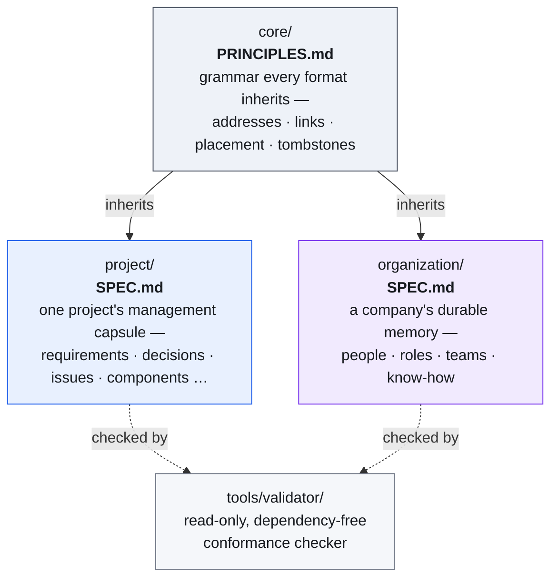
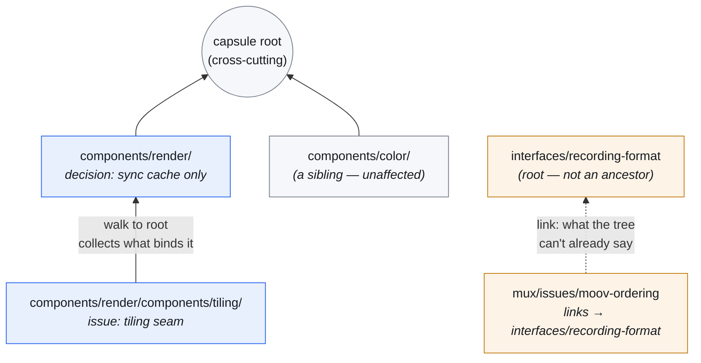

# Capsa

*A unified, portable project-management capsule — in plain, readable files.*

**Capsa** is a **standard file format**, not a program. It defines how a
project carries its own management truth — requirements, planning,
decisions, discussions, bugs & risks, dependencies & licenses, releases,
and development/design insights — as human-readable files that live
**inside the project's own repository**.

A Capsa capsule has **no active mechanism**: no hooks, no daemon, nothing
to run or maintain. It is passive data in an agreed format. Any tool — an
orchestration engine, a solo AI coding session, or a human with a text
editor — can read and write it, as long as it follows the spec.

A longer, illustrated introduction for a technical but non-coding reader is
in [`docs/capsa-explained.pdf`](./docs/capsa-explained.pdf).

## Why

Project-essential knowledge (why a decision was made, what a bug was and
how it was fixed, what the design rationale is) is **part of the project**.
It should travel with the project, survive any tool, and be readable
without one. Locking it inside an external management system makes that
system a foreign owner of the project's own truth.

Capsa puts that truth back where it belongs — in the project — in a format
that is:

- **Portable.** It's just files in the repo. Clone the project, get its
  full management history. Delete every tool; the capsule remains whole.
- **Readable.** Every record is Markdown a human can read, with a small
  YAML frontmatter header a machine can parse. One file serves both.
- **Dependency-free.** No runtime, no service, no library to install. The
  format *is* the contract.
- **Tool-agnostic.** The spec is the only thing consumers agree on. Version
  coordination is a single `capsa_version` field — not a protocol.

## The family

Capsa is not one format but a small **core** that several formats share.
Core defines the grammar — addresses, `links`, placement, the verification
block — and never defines record types; each format decides which records
it needs.



A project's capsule (`project/SPEC.md`) is installed as `.capsa/` inside the
product repository — it travels with the code. An organization's capsule
(`organization/SPEC.md`) lives wherever an operator keeps company-wide state,
separate from any one project. Neither depends on the other; an organization
capsule may *point at* a project it runs, but the project's truth stays in
the project's own capsule (core §Single home).

## What's in a project capsule

```
.capsa/
├── capsule.yaml          the manifest (§3)
├── charter.md            vision, constraints, ground rules
├── requirements/         needs, formally trackable to met/unmet with evidence
├── plans/                initiatives with work-breakdown, priority, target date
├── decisions/            architecture decisions (ADRs), append-only
├── discussions/          substantive considerations (may graduate to a decision)
├── issues/               bugs / risks / tasks, with lifecycle & severity
├── dependencies/         <eco>-<name>.md — license, tier, admitting decision
├── NOTICES               generated third-party attribution
├── releases/             what shipped, when, from which commit
├── insights/
│   ├── dev/              development insights — lessons, rationale, what failed
│   ├── design/           design insights — UX, product, visual-language reasoning
│   └── code/             code-anchored notes (carry `code_globs`)
├── components/           the system's own structure — nests, and owns records
│   └── <slug>/
│       ├── component.md  what this part is, and which code it owns
│       ├── issues/       records belonging to this component
│       └── components/   nested components
├── interfaces/           contracts others depend on, with their own lifecycle
├── milestones/           dated points several plans aim at
└── lines/                maintained release lines (26.x shipping, 25.x fixes)
```

A record is identified by its **path**, so names are kebab-case and the
`NNNN-` prefix is optional ordering — nothing has to allocate a number, and
two authors on two branches never contend for one.

### Placement is what a record applies to

A requirement or a decision filed under `components/render/` is in force for
`render` and everything inside it; one at the root is in force project-wide.
So what governs a given part of the system is found by **walking from it up
to the root** — no record declares a scope, nothing has to be kept in sync,
and moving a directory moves what governs it, which is exactly what
re-parenting a component means. The spec says which record types bind their
subtree this way (*normative*) and which merely describe (*descriptive*).



Reading a node in the tree is two separate moves, and only the first is
mandatory: the **walk to the root** collects everything normative that binds
it — that is the complete, deterministic obligation set, with nothing to
tune. The **neighbourhood** — siblings, nearby branches, a few hops over
`links` — is optional enrichment a consumer takes as far as it chooses.

Records also link to each other with typed edges, reserved for what the tree
cannot express — a dependency between siblings, a pointer across branches, a
reference into another capsule:

```yaml
links:
  - {rel: implements,     to: requirements/0003-verifiable-claims}
  - {rel: depends_on,     to: ../capture/component}             # relative: same subtree
  - {rel: constrained_by, to: "@acme/policies/license-tiers"}   # another capsule
```

An edge that only restates the tree is rejected, for the same reason a
component never stores its own owner: the path already says it. And a
reference inside one subtree is written relative, so the subtree can be moved
by dragging the directory, with nothing to edit.

A distinguishing property: **claims that can be checked are formal fields,
not prose.** A requirement's `met` status, a dependency's license `tier`, a
closed bug's `regression_ref`, a release's included issues — all are
structured frontmatter with evidence references, so any tool can compute
compliance in code (*"no deny-tier dependency without an admitting
decision"*, *"no open S1 at release"*). Prose explains; fields prove.

Every record is `<frontmatter> + <Markdown body>`. The frontmatter fields
are defined per record type in [`SPEC.md`](./project/SPEC.md). Copy-ready
starters live in [`project/templates/`](./project/templates/); a filled
example is in [`examples/`](./examples/).

## Using it

Capsa is passive, so "using it" just means reading and writing the files
per the spec:

- **A human** reads `.capsa/` in any editor, or on GitHub.
- **An orchestration engine** (e.g. a multi-agent team manager) is the
  writer: it reads the capsule to load project context and writes records
  back as part of its normal commits. Capsa holds the project truth; the
  engine holds only live run-state and cross-project views.
- **A solo AI session** can read and append records directly.

Want self-maintaining behavior (auto-consolidation, planning nudges)? That
lives **on top of** Capsa, as a separate optional layer — it is not part of
the standard. The standard stays passive on purpose.

## Validating a capsule (optional)

The format is the source of truth; validation is a convenience, never
required. A dependency-free checker is provided:

```sh
python3 tools/validator/validate.py path/to/project/.capsa
```

It checks the manifest and every record against `SPEC.md` §5 — names,
verification evidence, the component tree, and link/address integrity. It
only reads — it never writes or "fixes."

## Status

`capsa_version` **0.8.0**, on core **0.6.0** — see [`VERSION`](./VERSION),
[`SPEC.md`](./project/SPEC.md) and [`core/PRINCIPLES.md`](./core/PRINCIPLES.md). The
format is young; the shape is deliberately small so it can stabilize — and
shrinking it counts: 0.6.0 removed a record type, because "runs on Windows"
is a requirement of the code and a platform with its own code is a component,
so a `platforms/` type was a third name for what the format could already
say. See the changelogs in `core/PRINCIPLES.md` and `project/SPEC.md` for
what changed at each version and why.

## License

The Capsa specification and this repository are released under the MIT
License — see [`LICENSE`](./LICENSE). Capsules you create are yours; the
format imposes nothing on their contents.

---

*Capsa is the Latin word for the cylindrical case that held rolled
manuscripts — a portable box of readable records. That is exactly what
this is.*
